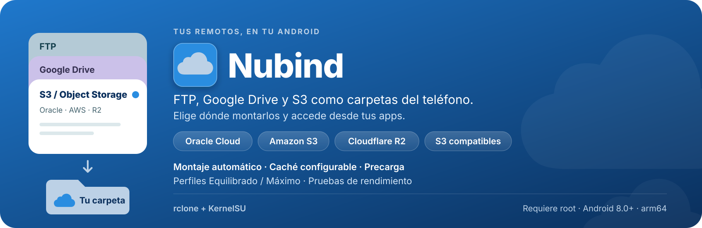
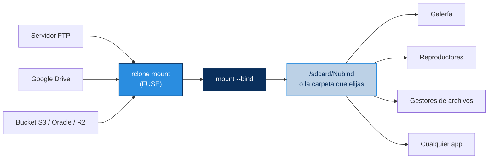
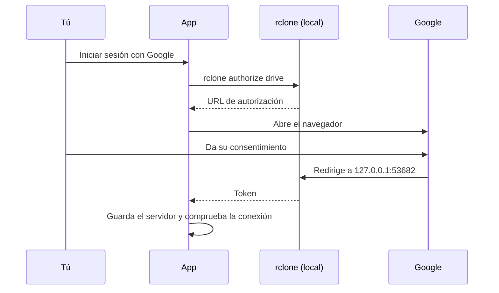

  

  
  
  
  

  
  
  
  
  
  
  

<h3 align="center">Monta servidores FTP, Google Drive y buckets S3 (Oracle Cloud, Amazon S3, Cloudflare R2 y compatibles) como una carpeta más de tu almacenamiento interno. Cualquier app puede usarlos, sin configurar nada en cada una.</h3>

---

## Actualizaciones

Nubind se actualiza solo desde la propia app, a partir de `update.json` (publicado por el CI en el release fijo `updates`, el mismo que lee KernelSU).

- **Búsqueda silenciosa:** al abrir la app, al volver a ella (máx. cada 30 s), cada 5 min mientras está a la vista y al entrar a **Acerca de**. Sin red no muestra nada, y no pisa descargas ni instalaciones en curso. Deslizar hacia abajo en Acerca de lanza una búsqueda manual, con «Buscando…» y aviso si falla.
- **Actualizar ahora:** con root descarga el APK, verifica su SHA-256, lo instala y se reabre sola; sin root abre el enlace de descarga en el navegador.
- **Cambios:** junto al botón aparece la píldora **Cambios**, que despliega las últimas 10 entradas del changelog (el asunto de cada commit) con la versión resaltada.
- **Módulo desfasado:** si el módulo KSU instalado trae un APK más viejo que la app, un aviso ámbar ofrece **Descargar y flashear módulo** (baja el zip, verifica `zipSha256` y lo flashea con root; no flashea si el publicado es más viejo que la app instalada). «Lo haré luego» lo pospone y deja una píldora ámbar **Módulo desfasado** para reabrirlo.
- **Reinicio pendiente:** tras flashear, una tarjeta verde **Módulo instalado** ofrece **Reiniciar ahora**. Si se pospone, queda la píldora verde **Reinicio pendiente**, que persiste aunque salgas de la app. Nunca hay dos píldoras a la vez.
- **Cabecera con color de estado:** la tarjeta de Acerca de pasa de los colores Monet a **verde** (actualización o reinicio pendiente) o **ámbar** (desfase), y la tarjeta del actualizador toma la misma paleta.
- La versión del módulo instalado aparece bajo la de la app (con root y módulo presentes).
- Los scripts de instalación (`self_update.sh`, `flash_module.sh`) reabren la app con el intent del launcher, para que no se apile una instancia nueva que arranque en Inicio.

## Cómo funciona

Iniciar sesión con Google se hace en el propio teléfono, sin PC:

## Características

### Servidores en una pila de tarjetas

- Cada servidor es una tarjeta; la seleccionada se abre y las demás asoman su franja.
- Tocar una tarjeta elige cuál se monta. Agregar, editar y eliminar desde la misma pantalla.
- Compatible con **FTP**, **Google Drive** y **S3** (Oracle Cloud Object Storage, Amazon S3, Cloudflare R2 y cualquier servicio compatible).
- En pantalla ancha (apaisado, tablets) se ven **tres paneles uno al lado del otro**, uno por tipo de remoto (FTP, Google Drive y S3); en vertical siguen mezclados en una sola pila, como siempre.
- Las contraseñas se guardan ofuscadas con `rclone obscure`.
- Al editar, dejar la contraseña vacía conserva la anterior.

### Encuentra tu servidor FTP solo

- Botón **Buscar servidores FTP en mi red**: recorre la subred local y muestra los que responden.
- Sondea el puerto 21 y los que usan las apps de servidor FTP para Android y Termux (2121, 2221 y 2222).
- Usa la red Wi-Fi o Ethernet real aunque haya datos móviles o VPN activos.
- No necesita root: elegir uno rellena Host y Puerto.

### S3 y Oracle Cloud Object Storage

- En **Nuevo servidor > S3** eliges **Oracle Cloud** (namespace + región; el endpoint `https://<namespace>.compat.objectstorage.<región>.oraclecloud.com` se arma solo) u **Otro proveedor** (endpoint propio: MinIO, Wasabi, B2...).
- Se inicia sesión con una clave de acceso: en Oracle, una **Customer Secret Key** (Perfil > Mi perfil > Claves secretas de cliente). La clave secreta solo existe en `rclone.conf` (chmod 600).
- **Bucket** opcional (`bucket` o `bucket/carpeta`): se monta solo ese. Vacío monta la lista de buckets, pero Oracle exige permisos de listado; si tu clave no los tiene, escribe el bucket.
- Al guardar, lista el bucket con la clave para confirmar endpoint, región, permisos y red, y traduce los errores típicos (`SignatureDoesNotMatch`, `AccessDenied`, `NoSuchBucket`...).
- **Icono por proveedor:** cada proveedor S3 tiene su propio icono (Oracle Cloud, Amazon S3 y Cloudflare R2 llevan su logo; los demás, una nube genérica). El proveedor se detecta por el dominio del endpoint (`S3Provider` en `Conf.kt`); para agregar uno nuevo basta una entrada del enum con los sufijos de su dominio y su icono en `serverIconFor` (`StyleKit.kt`).
- **Carpetas vacías:** se monta con `--s3-directory-markers` (rclone 1.64+): al crear una carpeta desde el explorador rclone sube un objeto vacío `carpeta/`, así se conserva aunque no tenga archivos y se puede montar vacía. La opción se añade si `rclone help flags --all` la lista o si el binario es 1.64 o más nuevo (antes dependía de `help flags` sin `--all`, que no lista las opciones de los backends, y no se aplicaba), y además se exporta `RCLONE_S3_DIRECTORY_MARKERS=true` como respaldo. Las carpetas vacías creadas con versiones anteriores nunca se subieron: hay que volver a crearlas. `unmount.sh` espera hasta 20 s a que rclone termine de subir antes de forzar el cierre.
- **Rendimiento de S3 / Oracle:** al elegir un servidor S3, la tarjeta **Rendimiento** de Inicio suma sus propias opciones (`S3PerfSection`; se aplican al volver a montar; cada una puede quedar en automático):
  - **Menos peticiones** (automático: sí en Oracle y Cloudflare R2, no en otros): `--use-server-modtime`, `--s3-no-head` y `--s3-no-head-object`. Evita un HEAD por archivo para leer su fecha (clave al listar o precargar miles de archivos) y las copias en el servidor que hacía rclone tras cada subida. Contrapartida: la fecha de modificación pasa a ser la de subida.
  - **Listados en caché** (5 min a 6 h; automático: 30 min en Oracle y R2, 10 min en Máximo y 5 min en Equilibrado para los demás): S3 no avisa de cambios hechos fuera del montaje, así que es lo que tarda en verse un archivo subido por otra vía.
  - Solo en **Máximo**: **lectura paralela** (1 a 12 trozos del mismo archivo, `--vfs-read-chunk-streams`, 4 por defecto), **subida paralela** (1 a 16 partes, `--s3-upload-concurrency`, 4 por defecto; 3 en Cloudflare R2) y **tamaño de parte** (8, 16, 32 o 64 MB, `--s3-chunk-size`, 14 por defecto). La RAM de subida en el peor caso es 4 transferencias × partes × tamaño; si pasa de 256 MB, el script baja las partes simultáneas y la tarjeta lo avisa. Con *menos peticiones* desactivado, los archivos de más de una parte se suben en paralelo (`--s3-upload-cutoff`); activado, suben de una vez hasta 200 MB.
  - Las opciones del backend se añaden solo si el binario de rclone las conoce (`rclone help flags`). Los ajustes viven en `config/s3_*` y el cálculo está en `scripts/perf_opts.sh` (`s3_mount_opts`), compartido con la prueba de rendimiento.
- El bucket se guarda en la clave propia `bind_path` de la sección; rclone la ignora y la leen `mount.sh` y `check_remote.sh`.

### Amazon S3

- En **Nuevo servidor > S3 > Proveedor** elige **Amazon S3** y escribe solo la **región del bucket** (por ejemplo `us-east-1`): el endpoint `https://s3.<región>.amazonaws.com` se arma solo (`.amazonaws.com.cn` en las regiones de China) y el remoto se guarda con `provider = AWS`.
- Se inicia sesión con una **clave de acceso de IAM** (Credenciales de seguridad > Crear clave de acceso) de un usuario con permisos sobre el bucket. Como en Oracle, se recomienda escribir el **bucket** (`bucket` o `bucket/carpeta`).
- Si la región no es la del bucket, al guardar la comprobación avisa «la región no es la del bucket».
- Mismas opciones de rendimiento que el resto de S3, pero por defecto **sin** recortar peticiones (Oracle sí): el listado se cachea 5 min en Equilibrado y 10 min en Máximo.
- Su tarjeta usa el naranja de AWS (seleccionada: fondo naranja con texto y logo en azul oscuro) y el logo cambia de variante según el fondo: letras azules sobre fondo claro y blancas sobre fondo oscuro.

### Cloudflare R2

- En **Nuevo servidor > S3 > Proveedor** elige **Cloudflare R2** y escribe solo el **Account ID** (32 caracteres, panel de Cloudflare > R2 > Resumen): el endpoint `https://<id>.r2.cloudflarestorage.com` se arma solo, la región es siempre `auto` y el remoto se guarda con `provider = Cloudflare`.
- Si tu bucket es de una **jurisdicción** (UE, FedRAMP), pega el endpoint completo (`https://<id>.eu.r2.cloudflarestorage.com`) en el mismo campo: se conserva tal cual. Al editar, el campo muestra el Account ID, o el host entero en ese caso.
- Se inicia sesión con un **token de API de R2** (R2 > Administrar tokens de API) con permiso de lectura y escritura de objetos: te da la **Access Key ID** y la **Secret Access Key**. Se recomienda escribir el **bucket**; un token acotado a un bucket no puede listarlos todos (por eso se guarda con `no_check_bucket = true`).
- Por defecto recorta peticiones (R2 cobra por operación pasado su cupo gratis) y cachea los listados 30 min, como Oracle. La **subida paralela** arranca en **3 partes** en vez de 6: R2 puede dar errores de firma en archivos grandes con 4 o más partes a la vez. Se puede cambiar a mano en la tarjeta Rendimiento.
- Su tarjeta usa el naranja de Cloudflare (seleccionada: fondo naranja con texto y logo en gris oscuro, porque el blanco no da contraste sobre ese naranja). El logo está trazado en vector a partir del PNG del icono (`CloudflareLogo.kt`), con sus cuatro tonos.
- Un servidor creado antes como «Otro proveedor» con un endpoint `*.r2.cloudflarestorage.com` se reconoce solo como R2 (tarjeta, icono y rendimiento); al volver a guardarlo se actualiza a `provider = Cloudflare`.

### Google Drive sin PC

- Inicio de sesión desde el teléfono con el flujo de autorización de rclone.
- Modo **solo lectura**.
- Interruptor para **permitir archivos marcados como malware** (`acknowledge_abuse`), que Drive bloquea con el error 403 `cannotDownloadAbusiveFile`.
- Montar solo una **carpeta raíz** o una **unidad compartida**.
- **Client ID y Secret propios**, o pegar un token generado en otro equipo.
- Al guardar, comprueba la sesión, la red, el DNS y los certificados listando la raíz de Drive.

### Cliente OAuth de Google Drive

La app trae su **propio cliente OAuth** integrado, así que no depende del cliente compartido de rclone (con cuota limitada). Si prefieres usar el tuyo, en las opciones avanzadas del servidor puedes escribir tu **Client ID** y **Client Secret**; si los dejas vacíos se usa el integrado.

Si compilas tu propia versión, define los secrets `GDRIVE_CLIENT_ID` y `GDRIVE_CLIENT_SECRET` en tu repo (Settings > Secrets and variables > Actions), o `gdriveClientId` / `gdriveClientSecret` en `~/.gradle/gradle.properties`. Sin ellos la app compila igual, pero sin cliente integrado y recurre al de rclone.

### Montaje que se mantiene

- Se monta con `rclone mount` y se expone con `mount --bind` en la **carpeta de destino que elijas** (por defecto `/sdcard/Nubind`), con selector de carpetas integrado.
- **Montar al iniciar**: espera a que el almacenamiento esté desbloqueado y reintenta hasta que haya red.
- Un **vigilante** restaura el bind si Android o alguna app lo quita.
- rclone, el vigilante y la precarga corren **fuera del grupo de procesos de la app** (`scripts/proc_detach.sh`): Android no los congela ni los mata al cerrar o minimizar la app, y rclone queda protegido ante el low memory killer.
- Cambiar de servidor con uno ya montado se hace con un solo botón.
- Caché de disco acotada para Drive.
- **Rendimiento** Equilibrado o Máximo: Máximo usa caché completa en FTP, Drive y S3, lectura anticipada de 64 MB y buffers de 16 MB por archivo. Drive y S3 usan por defecto 4 streams de lectura de 16 MB si el binario admite `--vfs-read-chunk-streams`. Las subidas se mantienen en 4 transferencias y 8 verificadores; Drive usa partes de 16 MB. Solo se acelera el pacer si hay `client_id` propio; con el cliente compartido se conservan los valores de rclone. Se agrupan escrituras durante 15 s y los atributos se cachean 1 min. No se fuerza `--vfs-fast-fingerprint`, para no sacrificar detección de cambios externos.
  **Caché**: Máximo permite 1–100 GB (10 por defecto); Equilibrado usa 1 GB e ignora cualquier tamaño personalizado residual. Todos los perfiles intentan conservar 2 GB libres. Los límites de VFS son blandos: archivos abiertos y subidas pendientes pueden superarlos. FTP Equilibrado cachea escrituras, no lecturas.
  **Caché en RAM**: tmpfs opcional solo en Máximo. Se comprueba el tamaño elegido + 2 GB de margen VFS + una reserva para el sistema de al menos 1 GB o el 25% de MemAvailable. No se reserva físicamente toda esa RAM al montar, se consume según se llena. Si no alcanza, se usa disco y queda registrado en Logs. No acelera la red; el contenido se pierde al desmontar/reiniciar y las escrituras pendientes pueden perderse ante un corte o reinicio.
  **Precarga automática** (`scripts/preload.sh`): solo en Máximo. Descarga en segundo plano hasta el presupuesto configurado menos 512 MB (contado en bytes exactos), con límites de tiempo, empezando por los archivos más pequeños. `config/preload_max_files` permite cambiar el máximo de archivos (20000 por defecto). El progreso aparece en Inicio y se puede relanzar manualmente. Los ajustes de rendimiento S3 son globales, no por servidor, y se aplican al volver a montar.
  El botón **Probar rendimiento** abre una hoja con la prueba (`scripts/perf_test.sh`, con root): comprueba
  que las opciones con las que corre rclone son las de la configuración actual (avisa si cambiaste el perfil o la
  caché sin volver a montar), que hay espacio para la caché, que el listado funciona, y mide escritura y lectura
  (un trozo al azar de un archivo grande, leído dos veces, viendo si la caché en disco crece). Escribe un archivo
  temporal de 32 MB en la carpeta montada y lo borra. Guarda la última velocidad por perfil y tipo de servidor:
  probando una vez en Equilibrado y otra en Máximo se pueden comparar.

### Respaldo cifrado de servidores

- En **Servidores**, el botón de respaldo (a la izquierda del «+») abre una hoja con modo **Exportar** / **Importar** (requiere root).
- El `rclone.conf` completo (logins FTP, claves S3, tokens de Drive) se cifra con **AES-256-GCM**; la clave sale de una contraseña que eliges (mínimo 8 caracteres, se pide dos veces) con **PBKDF2-HMAC-SHA256** (600 000 vueltas). Formato `.nubind`.
- Nunca se sube nada en claro: las contraseñas de rclone solo están ofuscadas, no cifradas.
- El archivo se guarda o elige con el selector de Android (SAF, sin permisos nuevos), así que puedes mandarlo a la nube que quieras.
- **Importar mezcla:** los servidores con el mismo nombre se reemplazan y el resto se conserva. Solo entran secciones FTP, Drive y S3.
- Solo respalda servidores y logins: no incluye tamaños de caché, ajustes S3 globales ni el servidor activo.
- La hoja no se cierra mientras trabaja; si falla, muestra el error dentro y se queda abierta.

### Pantalla Servidores

- Tarjeta de resumen arriba: insignia que gira mientras hay algo montado y «Guardados: N».
- Estado vacío con botón **Agregar servidor** y atajo **Importar un respaldo**.
- Acciones de la barra como botones tonales (respaldo y «+»).

### Pantalla Logs

- Cada línea se interpreta (formato del módulo y de rclone) y se dibuja con una **barra de color por severidad**: error rojo, aviso ámbar, listo verde, info neutra. Arriba, píldoras con el total de líneas, errores y avisos. Compartir envía el log completo.
- **Desplazamiento rápido:** mantén el dedo quieto ~0,3 s sobre el log y vibra; después el log sigue tu deslizamiento, y deslizar por el alto del área táctil recorre el log entero. Una **lupa** del sistema (Android 9 o superior) se coloca 2 cm sobre el dedo y amplía lo que hay allí; flechas arriba/abajo indican la dirección.
- **Oculta por defecto:** la pestaña Logs se activa en **Acerca de > Sistema > Mostrar Logs** (la primera vez se explica cómo volver a ocultarla). Se oculta con el mismo interruptor o **manteniendo 3 s** el botón Logs de la barra, sin confirmación y con animación. Ocultarla no detiene el registro.

### Avisos expressive

- No quedan `Toast` ni `Snackbar`: todo aviso es una tarjeta flotante Material Expressive que entra con resorte y se cierra sola, al tocarla o al deslizarla. Cuatro tipos: **éxito**, **info**, **advertencia** (debes hacer algo) y **error**.
- Desde el tile de Ajustes rápidos se muestra como notificación emergente breve (cae a `Toast` si las notificaciones están desactivadas).
- **Aviso de datos móviles:** antes de una precarga o prueba sobre datos móviles, un diálogo propio pide confirmar. Cancelar es el botón principal; «No volver a mostrar» disponible.

### Precarga: ajustes, pausa y notificación

- La tarjeta **Precarga** de Inicio se despliega para ajustar las **descargas en paralelo** (1 a 8) y el **límite de velocidad** (en MB/s; sin límite por defecto). Aplican en la siguiente corrida, sin remontar.
- **Pausar y reanudar** desde la tarjeta o desde la notificación: el archivo en curso termina y los workers esperan.
- **Notificación de progreso:** en Android 16 o superior es una *actualización en vivo* con barra de 4 tramos, la nube que viaja por ella y el porcentaje (azul, ámbar en pausa); en versiones anteriores, la notificación estándar con barra. Al terminar se retira sola.

### Selector de carpetas animado

- Entrar a una subcarpeta desliza la página nueva desde la derecha; subir, al revés. La altura del diálogo se acomoda sin saltos y la ruta cambia con un deslizamiento corto. La caché de listados y la apertura instantánea siguen igual.

### Instalación y actualizaciones sin fricción

- El zip del módulo **trae la app dentro**: se instala sola al flashear.
- Reflashear **actualiza la app sin perder tus datos**, y la configuración del módulo se conserva.
- Si la instalación silenciosa falla, se reintenta al reiniciar y, como último recurso, abre el instalador del sistema.
- El módulo se actualiza desde el Manager de KernelSU.

### Diseño

- Material 3 con **color dinámico** (Material You) en Android 12 o superior.
- Modo **claro y oscuro** según el sistema, a pantalla completa.
- Esquinas amplias, animaciones con resorte y efecto de desenfoque.
- En **Acerca de**, la nube del logo protagoniza una escena al azar cada 4,5 a 9 segundos, sin repetir hasta haber visto todas: monta una carpeta que recibe archivos, despliega el mazo de servidores (FTP / Drive / S3), corre la prueba de rendimiento con velocímetro, absorbe paquetes en la precarga, abre una terminal con el escudo de acceso root, orbita con los logos de Amazon S3 / Cloudflare / Oracle / Drive, sincroniza con flechas y despierta con el interruptor de montaje automático. Tocarla lanza una al instante; se desactiva si las animaciones del sistema están apagadas (código en `LogoAnimations.kt`).
- Ancho del contenido adaptable: crece en pantallas anchas en vez de dejar franjas vacías a los costados.
- Inicio también arma **doble panel** en pantalla ancha: montaje (servidor, carpeta, botón) a la izquierda, ajustes (autostart y rendimiento) a la derecha.
- Icono adaptable con versión monocromática para el tema de íconos.
- Pantallas de **Inicio**, **Servidores**, **Logs** (oculta por defecto) y **Acerca de**, con la versión de la app, del módulo y de rclone.
- Hoja **Nuevo servidor** de alto fijo: cambiar entre FTP, Drive y S3 no la hace saltar ni rebotar.
- En Acerca de, las tarjetas entran escalonadas, los pasos de «Qué hace» van con insignias numeradas y los valores de Sistema en píldoras, con punto de estado en root.
- **Idiomas:** inglés (por defecto), español y portugués de Brasil. La app sigue el idioma del sistema (no hay selector). Los textos viven en `res/values/strings.xml` (inglés), `values-es/` y `values-pt-rBR/`, y se leen con `Strings.get(R.string.…)` (`Strings.kt`), que no necesita un `Context`; en enums y objects se guarda el `@StringRes` y el texto se resuelve al leerlo. Los mensajes que escriben los scripts del módulo en el log siguen en español.
- En apaisado, el difuminado sobre la barra de gestos es más bajo y más suave que en vertical.

### Publicación automática

- Cada compilación exitosa publica un release con el módulo y el APK.
- Los tags `v*` publican una versión con nombre.

## Compatibilidad

| | |
|---|---|
| Root | KernelSU |
| Android | 8.0 o superior |
| Arquitectura | arm64 |
| Remotos | FTP, Google Drive, S3 |
| Motor | [rclone](https://rclone.org) |

---

  Usa <a href="https://rclone.org">rclone</a> (MIT), <a href="https://github.com/topjohnwu/libsu">libsu</a> (Apache 2.0) y <a href="https://github.com/chrisbanes/haze">Haze</a> (Apache 2.0).

